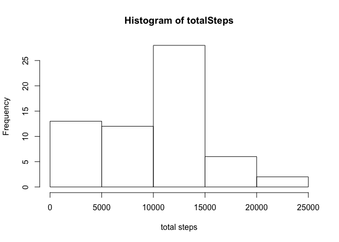
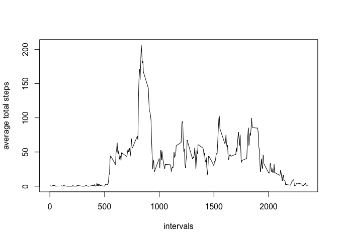
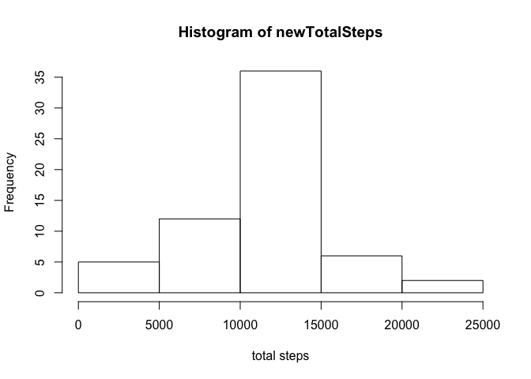
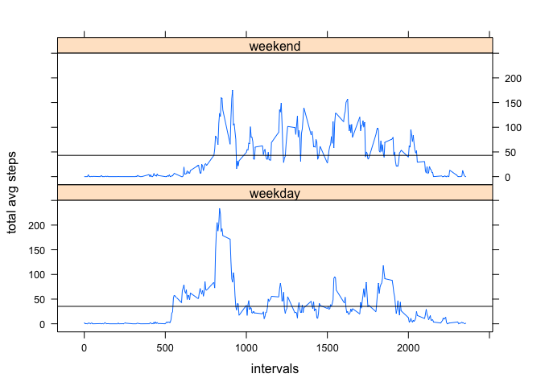

# Reproducible Research: Peer Assessment 1


##A. Loading and preprocessing the data
  

```r
Data <- read.csv("activity.csv")
```

##B. What is mean total number of steps taken per day?
  
####1. Calculating the total number of steps taken per day.  
####2. Making a histogram of the total number of steps taken each day.   

```r
totalSteps <- tapply( Data$steps, Data$date, FUN = sum, na.rm = TRUE)
hist(totalSteps, xlab = "total steps")
```

<!-- -->

####3.1 The mean of the total number of steps per day.  

```r
print(mean(totalSteps))
```

```
## [1] 9354.23
```

####3.2 The median of the total number of steps per day.  

```r
print(median(totalSteps))
```

```
## [1] 10395
```


##C. What is the average daily activity pattern?
####1. Making a time series plot of the 5-minute interval and the average number of steps taken across all days.  

```r
totalStepsIntervals <- aggregate(Data$steps, list(Data$interval), FUN = mean, na.rm = TRUE)
plot(x = totalStepsIntervals[[1]],y = totalStepsIntervals[[2]], type = "l",xlab = "intervals", ylab = "average total steps")
```

<!-- -->
    
####2. The maximum 5-minute interval containing the maximum number of steps.  

```r
theMaximumInterval <- totalStepsIntervals[which.max(totalStepsIntervals[[2]]),1]
print(theMaximumInterval)
```

```
## [1] 835
```


##D. Imputing missing values
####1. Calculating and reporting the total number of missing values in the dataset

```r
print(table(complete.cases(Data))[["FALSE"]])
```

```
## [1] 2304
```
####2&3. Filling in all of the missing values in the dataset with the mean value of total steps across all days for each interval.  

```r
newData <- Data
totalStepsIntervalsMean <- tapply(Data$steps, Data$interval , FUN = mean, na.rm = TRUE)
 for ( i in 1:(nrow(newData)) ){
   if(is.na(newData[i,1]))
     newData[i,"steps"] <- totalStepsIntervalsMean[[as.character(newData[i,"interval"])]]
 }
```
####4.1 Calculating the total number of steps taken per day and making a histogram of the total number of steps taken each day.  

```r
newTotalSteps <- tapply( newData$steps, newData$date, FUN = sum)
hist(newTotalSteps, xlab = "total steps")
```

<!-- -->
  
####4.2 Calculating and reporting the mean and median of the total number of steps per day

```r
print(mean(newTotalSteps))
```

```
## [1] 10766.19
```

```r
print(median(newTotalSteps))
```

```
## [1] 10766.19
```


##E. Are there differences in activity patterns between weekdays and weekends?
####1. Creating a new factor variable in the dataset with two levels – “weekday” and “weekend”

```r
dayTypes <- as.factor(ifelse(weekdays(as.Date(Data$date)) %in% c("Sunday", "Saturday"), yes = "weekend", no = "weekday"))
Data$daytype <- dayTypes
```
  
####2. Making the plot

```r
totalStepsWeek <- aggregate(Data$steps, list(Data$interval,Data$daytype), FUN = mean, na.rm = TRUE)
library(lattice)
xyplot(totalStepsWeek[[3]] ~ totalStepsWeek[[1]] | totalStepsWeek[[2]], layout = c(1,2),type = "l", xlab = "intervals", ylab = "total avg steps",panel = function(x,y,...){
  panel.xyplot(x,y,...)
  panel.abline(h = mean(y),...)
})
```

<!-- -->


